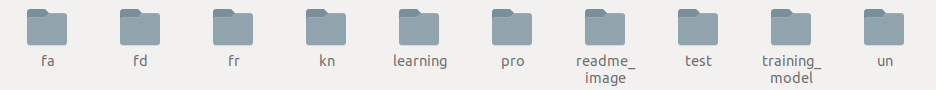

# Now_U_See_Me Learning process

#### 1. 시스템 소개

#### 2. 특징

#### 3. 사용법

#### 4. 실행 결과

#### 5. 라이선스

<br/>

## 1. 시스템 소개

**사용 기법 설명**

이 시스템에 사용된 딥러닝 모델은 LFW dataset에서 98.716%테스트 결과를 얻었으며, 얼굴 영역의 feature를 추출하여 기존 data들의과 같은 사람인지를 1:1 방식으로 비교합니다. 데이터가 많이 필요한 기존의 딥러닝 방식과는 다른 1장의 사진으로도 높은 정확도를 가지는 One-shot metric learning 기법을 사용하였습니다.

**시스템 설명**

Learning process는 두 가지 일을 처리합니다.

-server에서 받아오는 웹캠 frame에서 얼굴 영역을 crop 하고 기존 data들과 비교합니다.

비교한 결과가 외부인일 경우, client에게 알림을 줄 수 있도록 서버로 전송합니다.

-client에게 얻은 외부인 결과를 통해 기존의 Data(family or friends)들에 포함 할 수 있도록 처리합니다.

[](/https://www.youtube.com/watch?v=Q-vJoNmon1c&feature=youtu.be)

**모델 성능용 demo 영상입니다.**

<br/>

## 2. 사용법

3-1. 해당 프로젝트를 다운받고 training_model 디렉토리로 이동합니다.

```bash
 $ git clone https://github.com/gyeomo/Now_U_See_Me.git
```

2-2. **개발환경 구축** [training_model](https://github.com/gyeomo/Now_U_See_Me/tree/master/learn/training_model) 디렉토리의 README.md 를 보고 따라합니다.

2-3. **파일 복사**  2-2에서 생성된 파일을 `learn/learning/`디렉토리에 복사합니다.

```bash
learn/training_model/InsightFace-v2/BEST_checkpoint.tar
learn/training_model/InsightFace-v2/data/thereshold.txt
```

2-4. **디렉토리 생성** 시스템에 필요한 디렉토리들을 생성합니다.



2-5 **프로그램 실행**

```bash
1. 터미널 열기
2. cd learn/learning
3. $ python my_utils.py
4. $ python main.py
```


