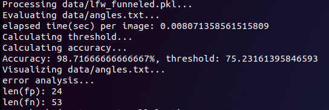
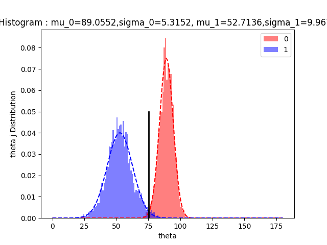

# Now_U_See_Me Learning process

#### 1. 소개

#### 2. 개발환경 구축

#### 3. 사용법

#### 4. 실행 결과

#### 5. 라이선스


## 1. 소개

이 시스템은 Face image의 


## 2. 개발환경 구축

```
- Linux 18.04
- Cuda 9.0
- cuDNN 7.6.1
- Python 3.6
- PyTorch 1.1.0
- OpenCV  4.1.0
- MxNet-cu90 1.4.1
- numpy 1.16.4
```

그 외 추가적인 것들은 `pip install [~]`


## 3. 사용법

#### 3-1. Source code download

```
방법1 [PyTorch version](https://github.com/foamliu/InsightFace-v2)
방법2 ` $ git clone https://github.com/gyeomo/Now_U_See_Me.git`
```

#### 3-2. Dataset download

3-2-1. [Dataset](https://github.com/deepinsight/insightface/wiki/Dataset-Zoo)에서 본인이 필요한 데이터를 다운로드합니다.
3-2-2. 다운로드 한 Dataset을 ` InsightFace-v2-master/data/` 에 넣어줍니다.
3-2-3. ` InsightFace-v2-master/extract.py` 의 코드를 수정합니다. 

```py
if __name__ == "__main__":
    if not os.path.isdir('data/dataset_name'): 
        extract('data/dataset_name.zip')
```

```bash
$ python extract.py
```

**아래부터는`InsightFace-v2-master` 를 `v2/` 로 표기하겠습니다.**

#### 3-3. 그 외 코드 수정

3-3-1.`v2/config.py`의  `pickle_file = 'data/dataset_name.pickle'`로 수정합니다.

3-3-2. `v2/pre_process.py`

```python
for i in tqdm(range(이미지 총 갯수)):
```

```pyt
print('num_samples: ' + str(len(samples))+samples[-1]['label'])
```

3-3-3.`v2/config.py` 

```py
num_classes = 총 label수
num_samples = 이미지 총 갯수
```

3-3-4. `v2/utils.py`의 `def parse_args()`를 수정합니다.

#### 3-4. Training & Testing

3-4-1. `v2/data/`에서 LFW data들을 download 합니다.

```bash
$ wget http://vis-www.cs.umass.edu/lfw/lfw-funneled.tgz
$ wget http://vis-www.cs.umass.edu/lfw/pairs.txt
$ wget http://vis-www.cs.umass.edu/lfw/people.txt
```

3-4-2. train 1에폭마다 test합니다.

```bash
$ python train.py
```


## 4. 실행 결과

#### Testing with LFW dataset   => Accuracy 98.716%

- 13233 faces
- 5749 identities 
- 1680 identities with >=2 photo														
  
  
  
  
  
#### 추가적인 정보

- **나의 컴퓨터 사양**

```
GeForce GTX 1080 Ti
AMD 라이젠7 2700
RAM 16G
```

- **변수 설정**

```
-Dataset Asian-Celeb
-dataset_name faces_glintasia
-num_classes = 93979
-num_samples = 2830146
-def parse_args()
 parser.add_argument('--network', default='r50', help='specify network')
 parser.add_argument('--end-epoch', type=int, default=20, help='training epoch size.')
 parser.add_argument('--lr', type=float, default=0.001, help='start learning rate')
 parser.add_argument('--optimizer', default=False, help='optimizer')
 parser.add_argument('--batch-size', type=int, default=128, help='batch size in each context')
 이 외는 그대로 두었습니다.

```

- **InsightFace-v2-master/files 기능들**

## 5. 라이선스

The code of InsightFace is released under the MIT License. There is no limitation for both acadmic and commercial usage.

The training data containing the annotation (and the models trained with these data) are available for non-commercial research purposes only.


