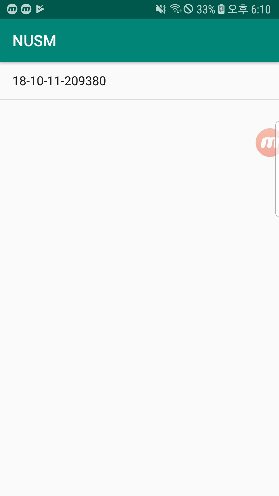
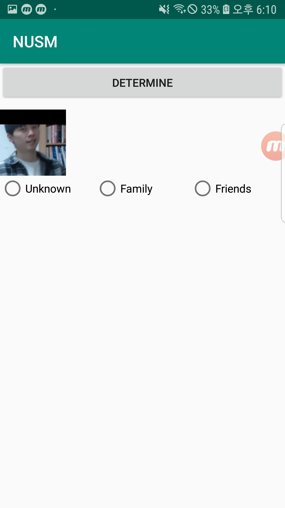

# Now_U_See_Me Mobile

## 1. 개발 환경 구축 및 설치
 - Android Studio 3.4.1    
   
 - Android 9  
   
 - build.gradle    
   
```java 
  
dependencies {
    implementation fileTree(dir: 'libs', include: ['*.jar'])
    implementation 'com.android.support:appcompat-v7:28.0.0'
    implementation 'com.android.support.constraint:constraint-layout:1.1.3'
    testImplementation 'junit:junit:4.12'
    androidTestImplementation 'com.android.support.test:runner:1.0.2'
    androidTestImplementation 'com.android.support.test.espresso:espresso-core:3.0.2'
    implementation 'com.google.firebase:firebase-core:16.0.8'
    implementation 'com.google.firebase:firebase-messaging:17.3.4'
    implementation 'com.squareup.okhttp3:okhttp:3.6.0'
    implementation 'com.google.code.gson:gson:2.8.5'
}  
  

```

## 2. 사용법  

1. 서버와 연결을 위해서 FCM으로부터 받은 토큰을 서버로 전송해야 하기 때문에 서버가 활성화가 됐을 때 어플을 실행해야 한다.
2. 어플이 실행되면 자동으로 서버로 토큰이 전달된다.
3. 외부인이 감지되면 FCM으로부터 Notification을 받는다.
4. 알림을 확인하면 어플에서 ListView를 통해 EventTime을 확인할 수 있다.  
   
   
  
5. EventTime을 누르면 그에 해당하는 사진을 확인할 수 있다.
	
6. 사진을 보고 Unknown, Family, Friends인지를 RadioButton을 통해 선택한다.
7. 선택이 완료되면 determine 버튼을 눌러서 결과를 서버로 전송한다.

  
## 3. 특징  
  
### [MainActivity](https://github.com/gyeomo/Now_U_See_Me/blob/master/mobile/app/src/main/java/com/dev/kih/nusm/MainActivity.java)  
  
```java 
handler = new Handler() 
```  
서비스 루틴이나 다른 View에서 MainActivity에 있는 ListView를 갱신하기 위해 Handler를 사용하였다.  

    
```java 
FirebaseInstanceId.getInstance().getInstanceId()
```
FCM으로부터 받은 Token을 서버로 전송한다.  
  
<br>
<br>  

### [SelectView](https://github.com/gyeomo/Now_U_See_Me/blob/master/mobile/app/src/main/java/com/dev/kih/nusm/ChoiceWho.java)  

서버로부터 전송받은 EventTime에 대한 이미지를 불러오고 각 인물에 대한 타입을 선정하여 서버에 결과를 전송하는 Activity이다.
<br>
<br>
```java
 public void createView(int dataSize)
```
이미지가 얼마나 올지 모르기 때문에 그 양에 따라 뷰를 동적으로 생성하는 함수이다.이미지 하나당 LinearLayout, ImageView, RadioGroup이 들어간다.
RadioGroup에는 RadioButton 3개씩 들어간다
<br>
<br>
  
### [Singleton](https://github.com/gyeomo/Now_U_See_Me/blob/master/mobile/app/src/main/java/com/dev/kih/nusm/Singleton.java)  
  
서비스루틴과 Activity에서 데이터를 효율적으로 사용하기 위해 Singleton 디자인 패턴을 사용하였다.   

singleton에 저장하는 변수 혹은 객체로는

- 서버에서 보낸 데이터를 저장하는 DataFrame
- 객체 생성을 위한 Context
- EventTime을 전송 혹은 사용하기 위한 eventTime
- MainActivity에서 생성한 Handler를 저장하는 handler

이 있다.
<br>
<br>
### [FCM](https://github.com/gyeomo/Now_U_See_Me/blob/master/mobile/app/src/main/java/com/dev/kih/nusm/MyFireBaseMessagingService.java)  

Notification을 받기 위해 
APP <-> FCM <-> Server 형식으로 구성하였다.  
FCM에 대한 결과를 받기 위한 부분이다. 
  <br>
  <br>
### [Server Communication](https://github.com/gyeomo/Now_U_See_Me/blob/master/mobile/app/src/main/java/com/dev/kih/nusm/ApiClient.java)  
  
서버와 통신하는 모듈이다.  
   
<br>
<br>
     
```java  
public boolean sendToken(String token)
```  
  
Token을 서버로 보낸다.
  
```java
 public boolean sendData
```  
  
eventTime을 서버로 보내어 eventTime에 대한 image값을 받아온다.

```java
public boolean sendResult
```  
  
`ChoiceWho.java`에서 선택한 값을 서버로 보낸다.

<br>  
<br>  
  
## Revision history
[now_u_see_me_mobile](https://github.com/kiryun/now_u_see_me_mobile)
